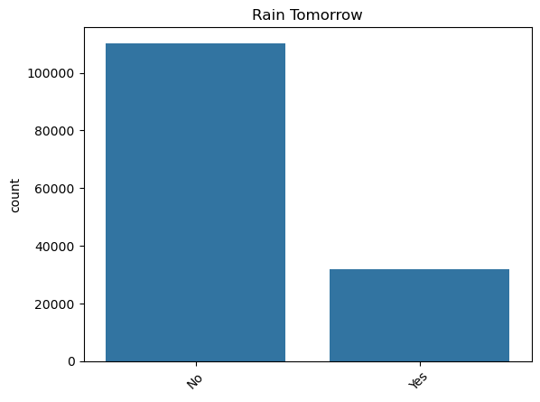

Predicting Rain in Australia
==============================

Project Aim
------------
The aim of the project is to predict if it will rain tomorrow based on todays weather.

The data set contains data from Australia is can be downloaded [here](https://www.kaggle.com/datasets/jsphyg/weather-dataset-rattle-package).

Data Exploration
------------
The given Dataset from Australia has 23 different columns and contains 145460 data entrys.

The target column is RainTomorrow, which is a Boolean. The target is unevenly distibuted (fewer rainy days).


The Data for today contains information about the date, the city, temperature, humidity, pressure, wind, clouds, sunshine and rain. Most variables are numeric. Categorical values are the location , wind related values (e.g. wind direction). Rains today is a boolean.
The dataset contains measurements from 49 citys/places.

|Missing values in %| |
|----------|----------|
|Date         |     0.000000 |
|Location     |     0.000000 |
|MinTemp      |     1.020899 |
|MaxTemp      |     0.866905 |
|Rainfall     |     2.241853 |
|Evaporation  |    43.166506 |
|Sunshine     |    48.009762 |
|WindGustDir  |     7.098859 |
|WindGustSpeed|     7.055548 |
|WindDir9am   |     7.263853 |
|WindDir3pm   |     2.906641 |
|WindSpeed9am |     1.214767 |
|WindSpeed3pm |     2.105046 |
|Humidity9am  |     1.824557 |
|Humidity3pm  |     3.098446 |
|Pressure9am  |    10.356799 |
|Pressure3pm  |    10.331363 |
|Cloud9am     |    38.421559 |
|Cloud3pm     |    40.807095 |
|Temp9am      |     1.214767 |
|Temp3pm      |     2.481094 |
|RainToday    |     2.241853 |
|RainTomorrow |     2.245978 |

How  to proceed with missing values: 
- delete entrys with over 10% of missing values
- replace Nans for cateforical variables with mode
- replace Nans for numerical variables with median

First Observation
------------
If it rains today, there is 50% chance that it also rains tomorrow. If it does not rain today, it will most likely also not rain tomorrow.

**RainTomorrow**
| RainToday | No    | Yes   |
|-----------|-------|-------|
| No        | 92728 | 16604 |
| Yes       | 16858 | 14597 |

Preprocessing data
------------
- How  to proceed with missing values: 
    - delete entrys with over 10% of missing values
    - replace Nans for categorical variables with mode
    - replace Nans for numerical variables with median
- delete Date column since it is not used for modelling (note: The date is deleted for making the model easier. One should keep in mind that the   seasons in fact have an influence on the weather. Therefore foradvanced modelling the date/month should be considered)
- encode RainToday and RainTomorrow in binary variable
- encode location and variables for wind direction with get_dummies (note: Since there are a lot of Locations in the dataset, this step leads to an enormous increase of the number of features)
- Scaling of numerical features by vector normalization

Modelling and Prediction
------------
The modelling script does model 4 different modeltypes:
  - KNeighbors
  - Decision Tree
  - Random Forest
  - Gradient Boosting

The modeling script then stores the best model with MLFlow.
The prediction script uses the best model stored in the previous step with MLFlow.


Project Organization
------------

    ├── LICENSE
    ├── README.md          <- The top-level README for developers using this project.
    ├── data
    │   └── raw            <- The original, immutable data dump.
    │
    ├── docker               <- These two folders contain 
    ├── docker_images        <- the docker files
    │
    ├── models             <- Trained and serialized models, model predictions, or model summaries
    │
    ├── mysql               <- database
    │
    ├── notebooks          <- Jupyter notebooks. Naming convention is a number (for ordering),
    │                         the creator's initials, and a short `-` delimited description, e.g.
    │                         `1.0-jqp-initial-data-exploration`.
    │
    ├── reports            <- Generated analysis as HTML, PDF, LaTeX, etc.
    │   └── figures        <- Generated graphics and figures to be used in reporting
    │
    ├── requirements.txt   <- The requirements file for reproducing the analysis environment, e.g.
    │                         generated with `pip freeze > requirements.txt`
    │
    ├── src                <- Source code for use in this project.
    │   ├── __init__.py    <- Makes src a Python module
    │   │
    │   ├── data           <- Scripts to generate the database and preprocess the data
    │   │   ├── make_dataset.py  
    │   │   └── preprocessing.py
    │   │
    │   ├── features       <- Scripts to turn raw data into features for modeling
    │   │   └── mlflow_server.sh
    │   │
    │   ├── models         <- Scripts to train models and then use trained models to make
    │   │   │                 predictions
    │   │   ├── predict_model.py
    │   │   ├── train_model.py
    │   │   └── weather_api.py   
    │   │
    │   ├── visualization  <- Scripts to create exploratory and results oriented visualizations
    │   │   └── Streamlit.py
    │   │
    ├── cron_pipeline.sh     <- cron pipeline to automate all steps
    └── docker-compose.yml   <- docker-compose file to run all Docker containers   

--------

<p><small>Project based on the <a target="_blank" href="https://drivendata.github.io/cookiecutter-data-science/">cookiecutter data science project template</a>. #cookiecutterdatascience</small></p>

Step SQL)
Task: store data in a local database (SQL)
Solution: src/data/convert_data_to_sql.py 
-> takes the big weatherAUS.cvs from this source: https://www.kaggle.com/datasets/jsphyg/weather-dataset-rattle-package?resource=download
-> converts it into a table called weather_table in weather_australia.db and save it in data/raw
src/test.sql.py 
-> checks for missing/extra columns and the right data type in the table (so far float or string)
src/data/make_dataset.py
-> loads the sql, ignores specific columns and simply filter (e.g the location) the big database. The results will be saved in data/raw
--note: for first instances the data folder and the database are not gitignored!!
-> make dataset filters the .db for e.g location or select a random amonúnt of data for the subset and save it as .csv with current date

Working with a real MySQL project.
- no databases are shared directly, raw data is weatherAUS.csv
- everybody needs to execute mySQL for database handling, either in docker or MYSQL workbench
STEP-BY-STEP guide
- install MYSQL
- initiating a MYSQL Connection (more infos on How To Do here: https://dev.mysql.com/doc/workbench/en/wb-getting-started-tutorial-create-connection.html)
- creating the schema: e.g. rain_australia
- running the script "create_table.sql" (change the first line (USE {your schema name}))
    - it creates the empty table
- running the script "import_data.sql" (change the third line (LOAD DATA INFILE 'your path', for me the table needed to be in the MY SQL SERVER folder))
    - it fills the empty table and can handle the 'NA' values from the raw data
- running the script "test_table.spl.sql" (change the first line (USE {your schema name}))
    - it should create an output with 145460 (number of rows in the table)
-> probably more useful in containerization


MySQL dockerization:

- build Docker image:
    - docker build -t weather-mysql .

- in another terminal "docker ps" for container ID

Enter MySQL client:
- e.g. docker exec -it c3ecfcd4a529  mysql -u root -proot (Container ID = c3ecfcd4a529, Password= root)
check the table with USE weather_db;SELECT COUNT(*) FROM weather_data;SELECT * FROM weather LIMIT 5; -> Outcome: 14560
- exit with quit


MLFLOW

- mlflow_server.sh 
    * sets up the mlflow server (http://localhost:8080)
- train model with simple mlflow architecture for tracking    

Dockerization 
---------------------------
four docker containers: `mysql`, `MLFlow`, `Streamlit` and `model` services are added to `docker-compose.yml`.

The mysql image is located at `mysql/Dockerfile`, the MLflow image is located at `docker_images/Dockerfile_mlflow`, the Streamlit image is located at `docker_images/Dockerfile_streamlit` while the model image is at `docker_images/Dockerfile_model`.

- `mysql` container hosts all the raw data
- `MLFlow` container hosts the mlflow server
- `model` container hosts the data substracting, data preprocessing, training, predicting, and FastAPI services
  - `test_model` container triggers the command to test the FastAPI service
- `Streamlit` container hosts the Streamlit app
  - `Make dataset` button triggers the command to substract the data from the whole data base (hosted by `mysql` container)
  - `Preprocess` button triggers the command to preprocesse the sub-dataset (created by `make dataset`)
  - `Train model` button triggers the command to train the model based on the preprocessed data (created by `preprocess`)
  - `Predict` button triggers the command to predict the value based on the model (trained by `training`)


- to start(or build if not exists) the docker compose:
```bash
docker-compose up --build
```

- to test the FastAPI:
```bash
# in a new terminal
docker-compose start test_model
```

- to open the Streamlit app, in your browser, go to http://localhost:8501/
- to visit the MLflow server, in your browser, go to http://localhost:8080/


<!-- Use the training image built from `docker/training/Dockerfile.training`.

1) Start MLflow on host (repo root, venv optional):
```
mlflow server --host 0.0.0.0 --port 8080 --backend-store-uri sqlite:///mlflow.db --default-artifact-root ./mlartifacts
```

2) Build the image:
```
docker build -t weather-training -f docker/training/Dockerfile.training .
```

3) Run training in Docker (set MLFLOW_TRACKING_URI to your host IP):
```
docker run --rm -e MLFLOW_TRACKING_URI=http://<your-host-ip>:8080 weather-training python -u src/models/train_model.py
```

Docker (prediction container)
-----------------------------
Prediction uses the latest trained model from local MLflow artifacts (`mlartifacts`) and writes a CSV with predictions.  
Training and prediction both use the **same Docker image** (`weather-training`); only the command and mounted volumes differ.

1) Make sure training has been run at least once (so `mlartifacts/**/artifacts/model.pkl` exists).

2) Run prediction in Docker from the repo root.

**Linux / macOS:**
```bash
docker run --rm -it \
  -v "$PWD/data:/app/data" \
  -v "$PWD/mlartifacts:/app/mlartifacts" \
  weather-training python -u src/models/predict_model.py \
    /app/data/processed/weatherAUS_10percent_preprocessed.csv \
    /app/data/processed/weather_predictions.csv
```

**Windows PowerShell:**
```powershell
$proj = (Get-Location).Path
docker run --rm -it `
  -v "$proj\data:/app/data" `
  -v "$proj\mlartifacts:/app/mlartifacts" `
  weather-training python -u src/models/predict_model.py `
    /app/data/processed/weatherAUS_10percent_preprocessed.csv `
    /app/data/processed/weather_predictions.csv
```

This will:
- Load the latest `model.pkl` from `mlartifacts/**/artifacts/model.pkl`
- Evaluate on the input file
- Save predictions to `data/processed/weather_predictions.csv` on the host. -->
